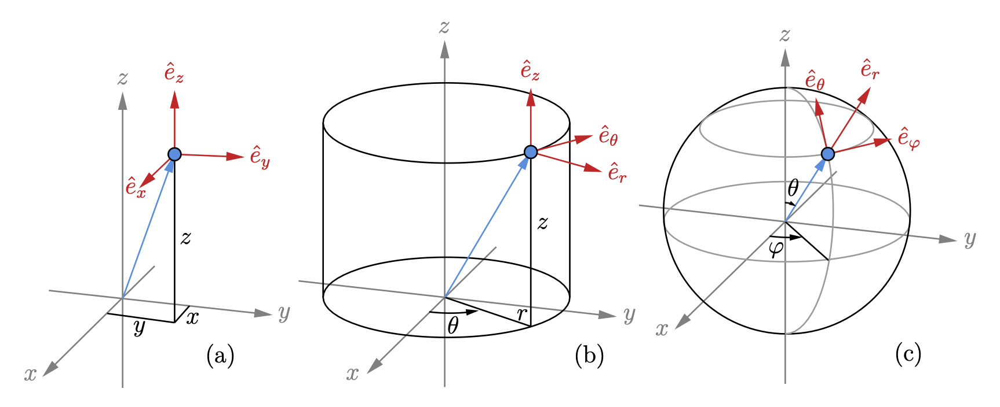

## The coordiante

$$
\begin{array}{c|c|c|c}
\text{Cartesian} & x & y & z\\
\text{Cylinder}  & r & \theta & z\\
\text{Spherical} & r & \theta & \varphi 
\end{array}
$$

## The Curl

### Cartesian coordiante

For a vector field $\vec{A} = A_x \hat{e}_x + A_y \hat{e}_y + A_z \hat{e}_z$
$$
\begin{aligned}
\nabla \times \vec{A} &= 
\begin{vmatrix}
\hat{e}_x & \hat{e}_y & \hat{e}_z\\
\partial_x & \partial_y & \partial_z\\
A_x & A_y & A_z
\end{vmatrix}\\[6pt] 
&= \left(\frac{\partial A_z}{\partial y}  - \frac{\partial A_y}{\partial z}\right)\hat{e}_x
- \left(\frac{\partial A_z}{\partial x}  - \frac{\partial A_x}{\partial z}\right)\hat{e}_y
+ \left(\frac{\partial A_y}{\partial x}  - \frac{\partial A_x}{\partial y}\right)\hat{e}_z
\end{aligned}
$$

## Cylinder coordinate

For a vector field $\vec{A} = A_r \hat{e}_r + A_\theta \hat{e}_\theta + A_z \hat{e}_z$
$$
\begin{aligned}
\nabla \times \vec{A} &= 
\frac{1}{r}\begin{vmatrix}
\hat{e}_r & r\hat{e}_\theta & \hat{e}_z\\
\partial_r & \partial_\theta & \partial_z\\
A_r & r A_\theta & A_z
\end{vmatrix}\\[6pt] 
&=\left(\frac {1}{r}\frac{\partial A_z}{\partial \theta}-\frac{\partial A_\theta}{\partial z}\right) \hat{e}_r
+\left(\frac {\partial A_r}{\partial z}-\frac {\partial A_z}{\partial r}\right) \hat{e}_\theta
+\frac{1}{r}\left(\frac {\partial}{\partial r}\left(r A_\theta\right)-\frac{\partial A_r}{\partial \theta}\right)\hat{e}_z
\end{aligned}
$$

#### Example1 - Cylinder

Suppose $\vec{A} = A_{\theta}(r,\theta,z)\hat{e}_{\theta}$, which means there are only angular component, then the curl is 
$$
\begin{aligned}
\nabla \times \vec{A} 
&= - \frac{\partial A_{\theta}(r,\theta,z)}{\partial z}\hat{e}_{r} + \frac{1}{r}\left(\frac{\partial}{\partial r}(rA_{\theta}(r,\theta,z))\right)\hat{e}_{z}\\
&= - \frac{\partial A_{\theta}(r,\theta,z)}{\partial z}\hat{e}_{r} + \frac{1}{r}\left(A_{\theta}(r,\theta,z) + r\frac{\partial A_{\theta}(r,\theta,z)}{\partial r} \right)\hat{e}_{z}\\
\end{aligned}
$$
then solving for $\nabla \times \vec{A} = 0$
$$
\begin{cases}
\displaystyle \frac{\partial A_{\theta}(r,\theta,z)}{\partial z} = 0\\
\displaystyle \frac{\partial A_{\theta}(r,\theta,z)}{\partial r} = -\frac{1}{r}A_{\theta}(r,\theta,z)
\end{cases}
$$
The first equation gives
$$
A_\theta = A_\theta(r,\theta,z) = A_\theta(r,\theta)
$$
so the second equation becomes
$$
\frac{\partial A_{\theta}(r,\theta)}{\partial r} = -\frac{1}{r}A_{\theta}(r,\theta)
$$
By experience, we let $A_{\theta}(r,\theta) = r^{-1}f(r,\theta)$​, plugin to the equation
$$
-\frac{f(r,\theta)}{r^2} + \frac{1}{r}\frac{\partial f(r,\theta)}{\partial r} = -\frac{1}{r^2}f(r,\theta)
\quad\Rightarrow\quad 
\frac{\partial f(r,\theta)}{\partial r} = 0,\quad r\neq 0
$$
so that $f(r,\theta) = f(\theta)$, we have the general solution for $\nabla \times \left(A_{\theta}\,\hat{e}_{\theta}\right) = 0$, which is 
$$
A_{\theta}(r,\theta) = \frac{f(\theta)}{r}
$$

>  then consider the Kelvin circulation
> $$
> \Gamma_{C} = \int_{C} \vec{A}\cdot d\vec{\ell} = \int_{C} \frac{f(\theta)}{r}(rd\theta) = \int_{C} f(\theta)d\theta
> $$
> If the function $f$ do not change sign on the path $C$, the integral must be positive

#### Example2 - Cylinder

$$
\nabla \times \vec{A} = \left(\frac {1}{r}\frac{\partial A_z}{\partial \theta}-\frac{\partial A_\theta}{\partial z}\right) \hat{e}_r
+\left(\frac {\partial A_r}{\partial z}-\frac {\partial A_z}{\partial r}\right) \hat{e}_\theta
+\frac{1}{r}\left(\frac {\partial}{\partial r}\left(r A_\theta\right)-\frac{\partial A_r}{\partial \theta}\right)\hat{e}_z
$$

> Let $\vec{A} = A_{\theta}(r,\theta,z)\hat{e}_{\theta}$, the curl left
> $$
> \nabla\times\vec{A} = - \frac{\partial A_{\theta}}{\partial z}\hat{e}_{r} + \frac{1}{r}\left(\frac{\partial}{\partial r}(rA_{\theta})\right)\hat{e}_{z}\\
> $$

#### Example3 - Cylinder

$$
\nabla \times \vec{A} = \left(\frac {1}{r}\frac{\partial A_z}{\partial \theta}-\frac{\partial A_\theta}{\partial z}\right) \hat{e}_r
+\left(\frac {\partial A_r}{\partial z}-\frac {\partial A_z}{\partial r}\right) \hat{e}_\theta
+\frac{1}{r}\left(\frac {\partial}{\partial r}\left(r A_\theta\right)-\frac{\partial A_r}{\partial \theta}\right)\hat{e}_z
$$

Let $\hat{e}_{r}$ and $\hat{e}_{z}$ component of $\nabla\times\vec{A}$ to be $0$, we have
$$
\begin{cases}
\displaystyle \frac{\partial A_{z}}{\partial \theta} = r \frac{\partial A_\theta}{\partial z}\\
\displaystyle \frac{\partial A_{r}}{\partial \theta} = \frac{\partial}{\partial r}\left(rA_{\theta}\right) 
	= A_\theta + r \frac{\partial A_{\theta}}{\partial r}
\end{cases}
$$
From the above equation we defined
$$
\begin{cases}
A_r = A_r(\theta)\\
A_\theta = A_\theta(r,z)\\
A_z = A_z(\theta)
\end{cases}
$$
then the equation becomes
$$
\begin{cases}
\displaystyle 
\frac{\partial A_\theta(r,z)}{\partial z} = \frac{1}{r}\frac{\partial A_{z}(\theta)}{\partial \theta}\\
\displaystyle
\frac{\partial A_{\theta}(r,z)}{\partial r} = \frac{1}{r}\left(\frac{\partial A_{r}(\theta)}{\partial \theta} - A_\theta(r,z)\right)
\end{cases}
$$
the first equation gives
$$
A_\theta(r,z) = \int \frac{1}{r} \frac{\partial A_z(\theta)}{\partial \theta} dz
= \frac{z}{r}\frac{\partial A_z(\theta)}{\partial \theta} + C_1(r)
$$
then derivative with respect to $r$, we have
$$
\frac{\partial A_{\theta}(r,z)}{\partial r} = -\frac{z}{r^2}\frac{\partial A_z(\theta)}{\partial \theta} + \frac{\partial C_1(r)}{\partial r}
$$
plugin to the second equation we have
$$
\frac{\partial A_{\theta}(r,z)}{\partial r} = -\frac{z}{r^2}\frac{\partial A_z(\theta)}{\partial \theta} + \frac{\partial C_1(r)}{\partial r} = \frac{1}{r}\left(\frac{\partial A_{r}(\theta)}{\partial \theta} - A_\theta(r,z)\right)
$$
Reduced to
$$
\frac{\partial A_{r}(\theta)}{\partial \theta} + \frac{z}{r}\frac{\partial A_z(\theta)}{\partial \theta} =  A_\theta(r,z) + r\frac{\partial C_1(r)}{\partial r}
$$
combining first two term, we have
$$
\frac{\partial}{\partial \theta}\left(A_{r}(\theta) + \frac{z}{r}A_{z}(\theta)\right) = A_{\theta}(r,z) + \left(r\frac{\partial C_1(r)}{\partial r}\right)
$$

integral $\theta$ both sides we get
$$
A_{r}(\theta) + \frac{z}{r}A_{z}(\theta) = \theta\cdot \left(A_{\theta}(r,z) + r\frac{\partial C_1(r)}{\partial r}\right)+C_2
$$
Let $c_1(r) = r\cdot \partial C_1(r)/\partial r$, we get
$$
A_{r}(\theta) + \frac{z}{r}A_{z}(\theta) = \theta \cdot A_{\theta}(r,z) + \theta \cdot c_1(r)+C_2
$$
or
$$
\left(A_{r}(\theta)-c_1(r) \cdot \theta\right) + \left(\frac{z}{r}A_{z}(\theta) - A_{\theta}(r,z)\cdot \theta\right) = C_2
$$

---

Letl
$$
A_r(\theta) = a + b\cdot \theta
,\quad
A_{\theta}(r,z) = \frac{k\cdot z}{r}
,\quad
A_{z} = k\cdot \theta
$$

$$
\begin{aligned}
\nabla \times \vec{A} 
&= \left(\frac {1}{r}\frac{\partial A_z}{\partial \theta}-\frac{\partial A_\theta}{\partial z}\right) \hat{e}_r
+\left(\frac {\partial A_r}{\partial z}-\frac {\partial A_z}{\partial r}\right) \hat{e}_\theta
+\frac{1}{r}\left(\frac {\partial}{\partial r}\left(r A_\theta\right)-\frac{\partial A_r}{\partial \theta}\right)\hat{e}_z\\
&= \left(\frac {1}{r}\frac{\partial A_z}{\partial \theta}-\frac{\partial A_\theta}{\partial z}\right) \hat{e}_r
+\frac{1}{r}\left(A_\theta + r\frac {\partial A_\theta}{\partial r}-\frac{\partial A_r}{\partial \theta}\right)\hat{e}_z\\
&= \left(\frac {1}{r}\cdot k - \frac{k}{r}\right) \hat{e}_r
+\frac{1}{r}\left(\frac{kz}{r} + r\cdot\frac{-kz}{r^2} - b\right)\hat{e}_z\\
\end{aligned}
$$

### Spherical coordinate

For a vector field $\vec{A} = A_r \hat{e}_r + A_\theta \hat{e}_\theta + A_\varphi \hat{e}_\varphi$
$$
\begin{aligned}
\nabla \times \vec{A} &= 
\frac{1}{r^2\sin\theta}\begin{vmatrix}
\hat{e}_r & r\hat{e}_\theta & r\sin\theta\,\hat{e}_\varphi\\
\partial_r & \partial_\theta & \partial_z\\
A_r & r A_\theta & r\sin\theta\,A_z
\end{vmatrix}\\[6pt] 
&= \frac{1}{r\sin\theta}\left(\frac{\partial}{\partial \theta}\left(A_z \sin\theta\right)-\frac{\partial A_\theta}{\partial \varphi}\right)\hat{e}_r
+ \frac{1}{r}\left(\frac{1}{\sin\theta}\frac{\partial A_r}{\partial \varphi} - \frac{\partial}{\partial r}\left(rA_{\varphi}\right)\right)\hat{e}_\theta
+ \frac{1}{r}\left(\frac{\partial}{\partial r}\left(r A_\theta\right) - \frac{\partial A_{r}}{\partial \theta}\right)\hat{e}_\varphi
\end{aligned}
$$
