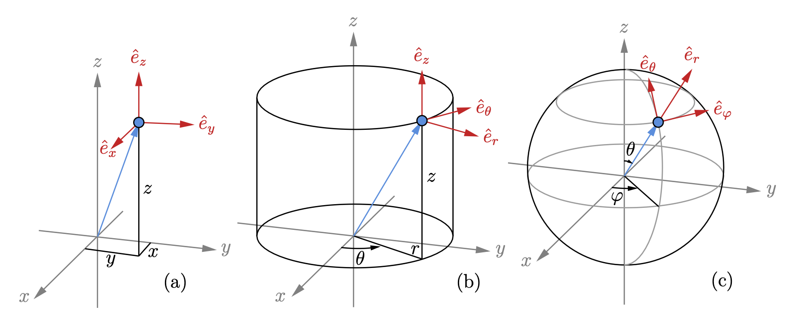

## The coordiante

$$
\begin{array}{c|c|c|c}
\text{Cartesian} & x & y & z\\
\text{Cylinder}  & r & \theta & z\\
\text{Spherical} & r & \theta & \varphi 
\end{array}
$$

## The Curl

### Cartesian coordiante

For a vector field $\vec{A} = A_x \hat{e}_x + A_y \hat{e}_y + A_z \hat{e}_z$
$$
\begin{aligned}
\nabla \times \vec{A} &= 
\begin{vmatrix}
\hat{e}_x & \hat{e}_y & \hat{e}_z\\
\partial_x & \partial_y & \partial_z\\
A_x & A_y & A_z
\end{vmatrix}\\[6pt] 
&= \left(\frac{\partial A_z}{\partial y}  - \frac{\partial A_y}{\partial z}\right)\hat{e}_x
- \left(\frac{\partial A_z}{\partial x}  - \frac{\partial A_x}{\partial z}\right)\hat{e}_y
+ \left(\frac{\partial A_y}{\partial x}  - \frac{\partial A_x}{\partial y}\right)\hat{e}_z
\end{aligned}
$$

## Cylinder coordinate

For a vector field $\vec{A} = A_r \hat{e}_r + A_\theta \hat{e}_\theta + A_z \hat{e}_z$
$$
\begin{aligned}
\nabla \times \vec{A} &= 
\frac{1}{r}\begin{vmatrix}
\hat{e}_r & r\hat{e}_\theta & \hat{e}_z\\
\partial_r & \partial_\theta & \partial_z\\
A_r & r A_\theta & A_z
\end{vmatrix}\\[6pt] 
&=\left(\frac {1}{r}\frac{\partial A_z}{\partial \theta}-\frac{\partial A_\theta}{\partial z}\right) \hat{e}_r
+\left(\frac {\partial A_r}{\partial z}-\frac {\partial A_z}{\partial r}\right) \hat{e}_\theta
+\frac{1}{r}\left(\frac {\partial}{\partial r}\left(r A_\theta\right)-\frac{\partial A_r}{\partial \theta}\right)\hat{e}_z
\end{aligned}
$$

### Spherical coordinate

For a vector field $\vec{A} = A_r \hat{e}_r + A_\theta \hat{e}_\theta + A_\varphi \hat{e}_\varphi$
$$
\begin{aligned}
\nabla \times \vec{A} &= 
\frac{1}{r^2\sin\theta}\begin{vmatrix}
\hat{e}_r & r\hat{e}_\theta & r\sin\theta\,\hat{e}_\varphi\\
\partial_r & \partial_\theta & \partial_z\\
A_r & r A_\theta & r\sin\theta\,A_z
\end{vmatrix}\\[6pt] 
&= \frac{1}{r\sin\theta}\left(\frac{\partial}{\partial \theta}\left(A_z \sin\theta\right)-\frac{\partial A_\theta}{\partial \varphi}\right)\hat{e}_r
+ \frac{1}{r}\left(\frac{1}{\sin\theta}\frac{\partial A_r}{\partial \varphi} - \frac{\partial}{\partial r}\left(rA_{\varphi}\right)\right)\hat{e}_\theta
+ \frac{1}{r}\left(\frac{\partial}{\partial r}\left(r A_\theta\right) - \frac{\partial A_{r}}{\partial \theta}\right)\hat{e}_\varphi
\end{aligned}
$$
